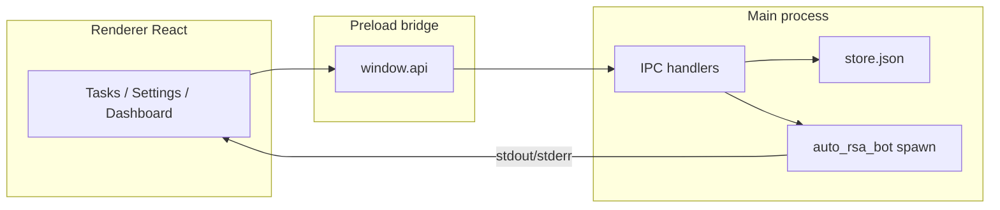

# Architecture

AutoRSA Desktop is an Electron app with three layers:

## Data flow for a task run

1. User confirms in renderer (in-app modal, not native `confirm`).
2. Renderer calls `window.api.rsaRun({ args, cwd, autoRsaExecutable, timeoutMs })`.
3. Main resolves CLI via `botLaunch.ts` (`.exe`, `.cmd`, or `python -m auto_rsa_bot`).
4. Child process runs with `DANGER_MODE=true` and streams logs via `rsa:log`.
5. Renderer updates task status, run history, optional holdings snapshot, and live-run audit log.

## Shared types

Types live in `src/shared/types.ts` and are used by main, preload, and renderer.

## Persistence

- `store.json` — tasks, groups, settings (atomic write + `.bak`)
- `live-runs-audit.log` — append-only live command audit trail

## Python side

The app does not embed Python; it expects `python/venv` from `setup.ps1`, `setup.bat`, or `setup.sh`.
